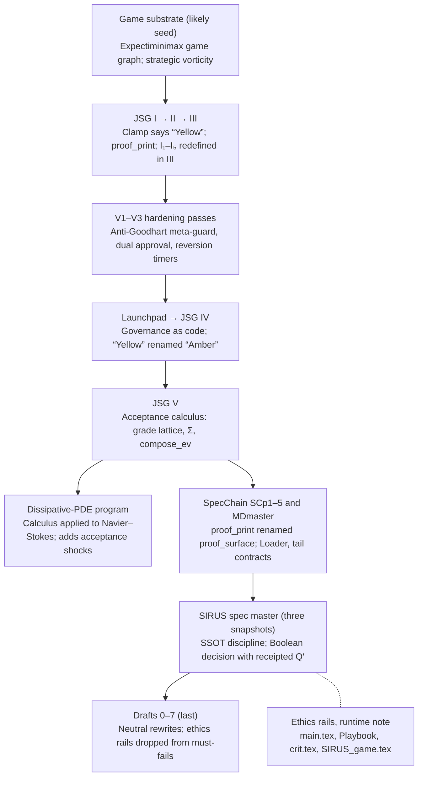

# JSG / SIRUS Master Guide (Skeleton)

Sep 29, 2026 · @Marley McWilliams

## Purpose and reading rules

This guide is the single canon for JSG I–V, SpecChain, the SIRUS spec, the Navier–Stokes program, and the drafts. Every component carries a tag that says what can justify it.

1. **One home per concept.** Each term is defined once, in the glossary. Other documents link to it and never restate it.
2. **Every component names its justification:** provable in Lean now, provable with analysis, checked per certificate, tested in CI, open mathematics, or a declared value (see the layer map).
3. **Conformance is not correctness.** CI shows the work conforms to the spec. Lean shows the spec's internal lemmas hold. Neither shows that a threshold, a model, or a value is right; that stays a signed human decision.
4. **Retired terms stay as aliases.** Old documents keep reading correctly, and new text uses only canonical terms.

## Corpus lineage

The JSG books came first and the neutral drafts last. The order is inferred from renamed terms, because the dates embedded in the files are partly example values.



*corpus lineage · 8 stages, 2 side branches*

Solid arrows mean a stage builds on the one before it; the dashed line marks work from the same period. The PDE program branches off the JSG V calculus.

## Canonical glossary

Twenty terms, each with one home. Two are still open decisions: sequential composition and the SIRUS name.

| Canonical term | Meaning | Replaces or aliases | Home |
| --- | --- | --- | --- |
| Grade lattice **G** | Per-axis values in ℝ≥0 ∪ {⊤}, bigger is worse, ordered coordinatewise | "Q" in JSG V and the PDE paper; "Q" in SCp2 | JSG V §2 |
| Floor axes **M** | Axes where the worst reading counts; combined by max; reordering never charges them | max-channels, Q\_max | JSG V; PDE §2.1 |
| Budget axes **S** | Axes that add up and can be spent; frontier debits land here | sum-channels, Q\_sum, ledger and CVaR axes | JSG V; PDE §2.1 |
| Unknown **⊤** | Top of every axis; absorbs under every operator; allowed on a budget axis only up to a registered lease β | ⊤unk (JSG V, PDE); ⊥ in SCp2 (reversed orientation); "third value" (SIRUS spec) | PDE §2.1, I4b |
| Parallel join **⊕** | Combines disjoint subsystems: max on M, sum on S | horizontal ⊕ (JSG V); ∧ (PDE); ⊎ and ⊙ (SCp2) | JSG V |
| Sequential composition **⊗** | Combines stages in time. Open decision: JSG V takes max on every axis, SCp2 sums every axis, the PDE paper reuses ⊕ | vertical ⊓ (JSG V); ⋆, and ∧ as its alias (SCp2) | Open |
| Decision **D** | {REJECT < ACCEPT}; no third value | "Q" in the SIRUS spec | SIRUS spec §1.2 |
| Verdict map **δ\_θ** | ACCEPT iff every axis is known and at or below its threshold θ | Implicit threshold checks | New |
| Receipted result **R** | (decision, receipt address, grade, metrics); projection π(R) = decision; metrics cannot flip a REJECT | Q′ | SIRUS spec §1.4 |
| Obligations **Σ** | Multiset of typed obligations; each discharged only by its authority with its witness; a pass leaves Σ empty | Typed effects | JSG V §3; PDE §2.2 |
| Frontier debit **Δ\_fr** | Priced cost of a regime crossing or reassociation, charged to S only | C\_fr, frontier spend, C\_salt | PDE §10 |
| **proof\_surface** | Window or run digest binding the guard IDs in fixed order | proof\_print, proof print | SCp1 |
| Guard order | EF → DRO → PR → CBF → ω | None | JSG III |
| **ω stage** | Automata verdict over KPI row hashes; the fifth guard | "Ω" in the SIRUS pipeline | JSG III |
| Uncertainty set **𝒰** | Model-uncertainty set for PR/GKYP witnesses and degraded profiles | "Ω" in JSG II–IV, including Ω\_wc | JSG IV §Ω contract |
| Clamp states | Green, Amber, Red | "Yellow" | JSG IV |
| Invariant families | Prefix by family: H1–H5 (governor, JSG III list), A1–A5 (PDE acceptance), L1–L10 (Loader), T11–T13 (tail contracts) | I₁–I₅ (three incompatible versions); I1–I13 | New |
| Policy preorder **⪰** | P₂ ⪰ P₁ iff no dial is weaker; ⪰ changes are permanent, all others expire | ThresholdChange VC semantics | JSG IV |
| **SIRUS** (this project) | The governance and evidence spec | Also the name of Bénard et al.'s random-forest rule-set algorithm; the two were merged in MDmaster | Open: rename or disambiguate |
| Content address | BLAKE3-256 of canonical bytes | `b3:…` placeholders (849 in the master spec) | SIRUS spec §0.5 |

## Layer map

Eleven components can be proved in Lean now and five more with analysis; the other eight are checked per instance, tested, open, or declared. Lean status is "Stub" wherever the Lean section below already states the theorem.

| Component | Layer | Lean status | Source |
| --- | --- | --- | --- |
| Grade lattice laws: join monotone, associative, commutative; ⊤ absorbs | Lean now | Stub | JSG V §2 |
| Lax interchange law | Lean now | Not started | JSG V §2 |
| Verdict map antitone; unknown forces REJECT | Lean now | Stub | SIRUS spec §1.2–1.3 |
| No confidence inflation (metrics cannot flip a verdict) | Lean now | Stub | SIRUS spec §1.4 |
| Σ discharge terminates; a pass leaves Σ empty | Lean now | Stub | JSG V §3; PDE Lemma 2.1 |
| Loader safety-or-halt (lexicographic rank) | Lean now | Stub | MDmaster SCp3 |
| Frontier debit subadditive and digest-monotone | Lean now | Stub | PDE Lemma 10.1 |
| Monotone policy changes compose | Lean now | Stub | JSG IV policy conservativity |
| Capped governance fold: bounded, with a vacuous nightly check | Lean now | Stub | JSG IV aggregator lemma |
| Must-fail sets only grow | Lean now | Stub | Draft0–7 |
| Unknowns lease: breach of β quarantines | Lean now | Not started | PDE I4b |
| CVaR tail-to-level step (C₀ = 1) | Lean + analysis | Not started | PDE Lemma 9.1 |
| No-Zeno dwell bound, corrected | Lean + analysis | Stub | JSG I Lemma 1 |
| Local KL–Fisher quadratic bound | Lean + analysis | Not started | JSG I FIM bound |
| DRO envelope identity dv/dρ = η\* | Lean + analysis | Not started | JSG II ρ-sensitivity |
| Geometry-scaled Jacobi frontier defect | Lean + analysis | Not started | JSG I Lemma 3 |
| PR/GKYP witnesses | Certificate | Not applicable | JSG II–IV |
| CBF tube residuals and saltation replay | Certificate | Not applicable | JSG III |
| Statistical gates: HAC and bootstrap CIs, BY FDR, SPRT, MTC | CI / test | Not applicable | JSG II |
| Determinism envelope and proof\_surface replay | CI / test | Not applicable | SIRUS spec §12; JSG IV |
| ACT→JSG compiler soundness and completeness | Open math | Not started | JSG IV Launchpad |
| Navier–Stokes regularity spine L1–L5 | Open math | Not applicable | DissipativePDEs |
| Golden Rule, restoration debt, consent brake, bravery-as-accountability | Norm | Not applicable | main.tex |
| Alignment budgets and override taxonomy | Norm | Not applicable | JSG I appendix |

## Unified core objects

Seven objects carry the whole calculus; every other component is built from them.

**1. Grade lattice.** A finite set of axes is split into floors M and budgets S.

```latex
G = \prod_{i \in M \cup S} \left(\mathbb{R}_{\ge 0} \cup \{\top\}\right), \qquad g \le h \iff g_i \le h_i \ \text{for all } i
```

```latex
(g \oplus h)_i = \begin{cases} \max(g_i, h_i) & i \in M \\ g_i + h_i & i \in S \end{cases} \qquad (\top \text{ absorbs in both cases})
```

**2. Verdict map and receipted result.** A threshold vector θ fixes δ\_θ(g) = ACCEPT iff g\_i ≤ θ\_i on every axis, so any ⊤ rejects. A receipted result R = (g, receipt, metrics) projects to π(R) = δ\_θ(g). Metrics are not an input to π, so "no confidence inflation" holds by construction.

**3. Obligations.** Σ is a finite multiset. Emit adds finitely many per window. Discharge(o, stage, witness) removes one and is legal only for o's authority. Acceptance is fail-closed: a window passes only if Σ = ∅.

**4. Frontier debit.** A crossing c has a jump F⁺ − F⁻ and digest-pinned constants. It is charged to S only, so floors are invariant under reassociation.

```latex
\Delta_{fr}(c) = \lVert F^+ - F^- \rVert \cdot A, \qquad A = \hat\nu_{\min}^{-1}\,\left(1 + c_\Sigma\, \kappa_{\max}\, r_{\mathrm{tube}}\right) \ge 0
```

**5. Policy preorder and governance fold.** A policy is a vector of dials, and P₂ ⪰ P₁ iff no dial is weaker. A ⪰ change is permanent. Any other change is a weakening: it needs an expiry, and on expiry the runtime reverts to the strictest unexpired policy P\*. Weakenings fold as below; admission must test the unclipped total (see Known defects).

```latex
R_{1:n} = \min\left\{R_{\max},\; R_{1:n-1} + \lambda\, \phi^{[\text{emergency}]}\, R(\Delta_n)\right\}
```

**6. Loader rank.** The Loader's state carries a rank r ∈ ℕ⁵ under lexicographic order. Every accepted transition strictly lowers r; otherwise the Loader halts with a rejection certificate. Well-foundedness gives safety-or-halt.

**7. Must-fail sets.** For successive norms versions, MF(N\_t) ⊆ MF(N\_{t+1}). Removing a failure class is a weakening and follows rule 5.

## Lean 4 statement stubs

This is an uncompiled sketch against Mathlib. Each `sorry` is one proof obligation, and three statements already close without one (`no_flip`, `monotone_compose`, `mustFail_monotone`).

```lean
import Mathlib

namespace JSG

/-! ## 1. Grade lattice -/

/-- One axis: bigger is worse, `⊤` is unknown. -/
abbrev Axis := WithTop NNReal

/-- Floors combine by max; budgets add. -/
inductive Kind | floor | budget

variable {ι : Type} (kind : ι → Kind)

abbrev Grade (ι : Type) := ι → Axis   -- Pi order is coordinatewise

def join (g h : Grade ι) : Grade ι := fun i =>
  match kind i with
  | .floor  => max (g i) (h i)
  | .budget => g i + h i

theorem join_comm (g h : Grade ι) : join kind g h = join kind h g := by sorry
theorem join_assoc (g h k : Grade ι) :
    join kind (join kind g h) k = join kind g (join kind h k) := by sorry
theorem join_mono {g g' h h' : Grade ι} (hg : g ≤ g') (hh : h ≤ h') :
    join kind g h ≤ join kind g' h' := by sorry
theorem top_absorbs (g h : Grade ι) (i : ι) (hi : g i = ⊤) :
    join kind g h i = ⊤ := by sorry

/-! ## 2. Verdicts and receipted results -/

inductive Decision | reject | accept
  deriving DecidableEq

/-- Accept iff every axis is known and within its threshold. -/
noncomputable def verdict (θ : ι → NNReal) (g : Grade ι) : Decision := by
  classical
  exact if ∀ i, g i ≤ (θ i : Axis) then .accept else .reject

theorem verdict_unknown (θ : ι → NNReal) (g : Grade ι) (i : ι) (hi : g i = ⊤) :
    verdict θ g = .reject := by sorry

/-- A worse grade never earns a better verdict. -/
theorem verdict_antitone (θ : ι → NNReal) {g g' : Grade ι} (h : g ≤ g')
    (hacc : verdict θ g' = .accept) : verdict θ g = .accept := by sorry

structure Receipted (ι : Type) where
  grade   : Grade ι
  receipt : String                  -- content address of the receipt envelope
  metrics : List (String × Float)

noncomputable def Receipted.proj (θ : ι → NNReal) (r : Receipted ι) : Decision :=
  verdict θ r.grade

/-- No confidence inflation: metrics cannot change the verdict. -/
theorem no_flip (θ : ι → NNReal) (r : Receipted ι) (m : List (String × Float)) :
    ({ r with metrics := m }).proj θ = r.proj θ := rfl

/-! ## 3. Obligations -/

variable {O : Type} [DecidableEq O]

/-- One legal discharge removes one open obligation. -/
def Discharges (s t : Multiset O) : Prop := ∃ o ∈ s, t = s.erase o

theorem discharge_decreases {s t : Multiset O} (h : Discharges s t) :
    Multiset.card t < Multiset.card s := by sorry

/-- Discharge-only runs terminate. -/
theorem discharge_wf : WellFounded (fun t s : Multiset O => Discharges s t) := by sorry

/-- Fail-closed acceptance. -/
def passes (s : Multiset O) : Prop := s = 0

/-! ## 4. Loader: safety-or-halt -/

abbrev Rank := ℕ ×ₗ ℕ ×ₗ ℕ ×ₗ ℕ ×ₗ ℕ

theorem safety_or_halt {S : Type} (rank : S → Rank) (step : S → S → Prop)
    (h : ∀ s t, step s t → rank t < rank s) :
    WellFounded (fun t s => step s t) := by sorry

/-! ## 5. Frontier debit -/

variable {E : Type} [NormedAddCommGroup E]

def debit (A : ℝ) (jump : E) : ℝ := ‖jump‖ * A

theorem debit_subadditive (A : ℝ) (hA : 0 ≤ A) (js : List E) :
    debit A js.sum ≤ (js.map (debit A)).sum := by sorry

theorem debit_mono_digest {A A' : ℝ} (hAA : A ≤ A') (j : E) :
    debit A j ≤ debit A' j := by sorry

/-! ## 6. Governance -/

/-- Dials, oriented so that larger is stricter; `p₂ ⪰ p₁` is `p₁ ≤ p₂`. -/
abbrev Policy (κ : Type) := κ → ℝ

theorem monotone_compose {κ : Type} {p₁ p₂ p₃ : Policy κ}
    (h₁ : p₁ ≤ p₂) (h₂ : p₂ ≤ p₃) : p₁ ≤ p₃ := le_trans h₁ h₂

def capAdd (Rmax lam : ℝ) (x y : ℝ) : ℝ := min Rmax (x + lam * y)

def fold (Rmax lam : ℝ) (rs : List ℝ) : ℝ := rs.foldl (capAdd Rmax lam) 0

/-- The defect, stated as a theorem: the nightly check `fold ≤ Rmax` cannot fail. -/
theorem fold_check_vacuous (Rmax lam : ℝ) (h : 0 ≤ Rmax) (rs : List ℝ) :
    fold Rmax lam rs ≤ Rmax := by sorry

/-- Proposed fix: admit a weakening only if the unclipped total stays within Rmax. -/
def admits (Rmax lam : ℝ) (rs : List ℝ) : Prop := lam * rs.sum ≤ Rmax

theorem admits_mono (Rmax lam : ℝ) (hl : 0 ≤ lam) (rs : List ℝ) (r : ℝ) (hr : 0 ≤ r)
    (h : admits Rmax lam (r :: rs)) : admits Rmax lam rs := by sorry

/-! ## 7. Must-fail sets -/

theorem mustFail_monotone {C : Type} (MF : ℕ → Set C)
    (step : ∀ t, MF t ⊆ MF (t + 1)) : Monotone MF :=
  monotone_nat_of_le_succ step

/-! ## 8. No-Zeno kernel (analysis layer, corrected form) -/

/-- If the signed distance moves no faster than `Smax`,
    going from `+r` to `-r` takes at least `2r / Smax`. -/
theorem dwell_lower_bound {d : ℝ → ℝ} {Smax r t₁ t₂ : ℝ} (hS : 0 < Smax)
    (hlip : ∀ s t, |d t - d s| ≤ Smax * |t - s|)
    (h₁ : d t₁ = r) (h₂ : d t₂ = -r) (ht : t₁ ≤ t₂) :
    2 * r / Smax ≤ t₂ - t₁ := by sorry

end JSG
```

Two simplifications to revisit. The Σ pass rule is definitional here, so the substantive theorem is termination. The fold scales every term by λ, including the first, which JSG IV leaves unscaled.

## Known defects and proposed fixes

Ten defects so far. The first two sit in theorems you would formalize early.

| Defect | Where | Why it matters | Proposed fix |
| --- | --- | --- | --- |
| Nightly fold check cannot fail | JSG IV aggregator lemma, R10, GovernanceFold | Once the total saturates at R\_max, later weakenings add nothing, so small loosenings accumulate unseen | Refuse any weakening whose unclipped total exceeds R\_max; freeze weakenings at the cap |
| No-Zeno proof sketch inverts its inequality | JSG I Lemma 1, ported to II–IV and the PDE paper | ḋ ≥ α − L·d bounds transit time from above, not below; the stated τ\_min treats α as a speed ceiling | Add the speed bound S\_max (C2); state τ\_min ≥ 2r/S\_max; keep α only to exclude sliding |
| Exchange-certificate bound is a hash | PDE paper §4.2, ExchCert | The bound replays exactly but carries no analytic content | Derive the bound from its norm and side conditions; keep the hash only to bind it |
| Three incompatible definitions of Q, with clashing operator symbols | JSG V, PDE paper, SCp2, SIRUS spec | Proofs about one "Q" don't transfer to another | Adopt G, D and R from the glossary; settle sequential composition |
| Name collision on SIRUS | MDmaster, "SIRUS API Reference" and "SIRUS Unified Documentation" | Documentation for Bénard et al.'s rule-set algorithm was merged in, with "\[Unverified\]" stubs | Remove those sections; rename the project or add a disambiguation line |
| Placeholder content addresses | SIRUS spec: 849 `b3:…` against 11 real digests | SSOT pointers don't bind anything yet | Generate digests in CI; fail the build on any `b3:…` |
| Drafts drop must-fails that their own rule protects | main.tex rails vs Draft0–7 | The corpus breaks its own monotone-governance rule | Restore the rails as must-fails, or record the removal as a signed, expiring weakening |
| Invariant numbering overloaded | JSG II vs III, PDE paper, SCp3–4 | "I₃" means different things in different files | Prefix by family, as in the glossary |
| Navier–Stokes L4 is conditional | PDE paper Lemma 3.5 | It assumes a finite ledger sum, which is where the difficulty lies | Keep the spine in the open-math layer; let nothing else depend on it |
| "If the CI passes, the work is correct" | Human\_Guide, step 4 | CI shows conformance, not correctness; cross-checking two agents misses errors they share | Reword: "If CI passes, the work conforms to the spec" |

## Source map

Seven sources stay canonical, four merge into the guide, two split, and the rest are archived. Rows follow the lineage order.

| Source | Canonical for | Action | Note |
| --- | --- | --- | --- |
| JSG I | Hybrid calculus, No-Zeno, alignment primitives | Keep | Fix the No-Zeno lemma first |
| JSG II | Runtime guards, MTC and IV badges, decision range, lever dictionary | Merge | Into the operations chapter |
| JSG III | Guard order, failure cookbook, lever ABI, curvature-per-collateral | Merge | Canonical for guard order |
| V1–V3 | Anti-Goodhart meta-guard, dual approval, out-of-band monitors, VCs | Merge | Merge the deltas, then archive the files |
| JSG IV Launchpad | Framing claim and the adequacy theorem statement | Keep | Becomes the guide's introduction |
| JSG IV | ACT compiler R1–R9, governance as code, emergency VCs | Keep | Canonical governance; fix the fold |
| JSG V | Acceptance calculus: G, Σ, compose\_ev | Keep | Canonical algebra |
| DissipativePDEs | Frontier subadditivity, CVaR bridge, acceptance shocks, Navier–Stokes spine | Split | Calculus parts into JSG V; Navier–Stokes into a research notebook |
| MDmaster | SpecChain SCp1–5 (Loader, tail contracts), game substrate, forward/inverse duality | Split | Keep SpecChain and the game sections; remove the SIRUS-algorithm sections |
| SIRUS\_SPEC\_MASTER | SSOT discipline, decision layer D and R, GMM, SSG, self-specification | Keep | The one canonical snapshot |
| SIRUS\_SPEC\_MASTER\_revised, Untitled.md | Near-duplicate snapshots, each about 1,300–1,450 lines different | Archive | Diff once for anything the master lacks |
| main.tex, Operational\_Playbook, crit.tex | Normative rails, the vow, the human-facing guide | Keep | Norm layer and onboarding |
| Repo\_conventions, Human\_Guide | WorkCard schema, PR plan, agent orchestration loop | Merge | Contributor docs; reword the CI claim |
| SIRUS.tex | Table scaffolding for the fixed pipeline | Archive | Template only |
| SIRUS\_game.tex | A pdfLaTeX error log; the runtime note survives only in its missing-character lines | Archive | Recover the text first |
| Draft7 | Neutral external proposal | Keep | The external-facing summary |
| Draft0–6 | Earlier versions of the same proposal | Archive | Superseded by Draft7 |

## Roadmap

Settle two decisions, freeze the glossary, then prove in three milestones. Milestone 1 is small and already contains a real catch: the fold check.

- [ ] Decide sequential composition: max on every axis (JSG V), sum on every axis (SCp2), or ⊕ for both (PDE paper)
- [ ] Decide whether the normative rails are must-fails inside the gates or a declared layer outside them
- [ ] Freeze the glossary and run one rename pass: 𝒰 for Ω, proof\_surface, Amber, invariant prefixes
- [ ] Lean milestone 1: grade lattice laws, verdict map, `no_flip`, fold vacuity with the fixed admission rule, must-fail monotonicity
- [ ] Lean milestone 2: Σ termination, Loader safety-or-halt, frontier debit subadditivity
- [ ] Lean milestone 3 (analysis): CVaR tail-to-level, the corrected dwell bound, then the local KL–Fisher bound
- [ ] CI: fail the build on any `b3:…` placeholder and on any must-fail removed without a signed weakening
- [ ] Recover the SIRUS\_game runtime note and remove the SIRUS-algorithm sections from MDmaster
- [ ] Move the Navier–Stokes spine to a research notebook, outside the guide's dependency graph

The step-by-step plan for doing all of this is in [Project roadmap](ROADMAP.md).
