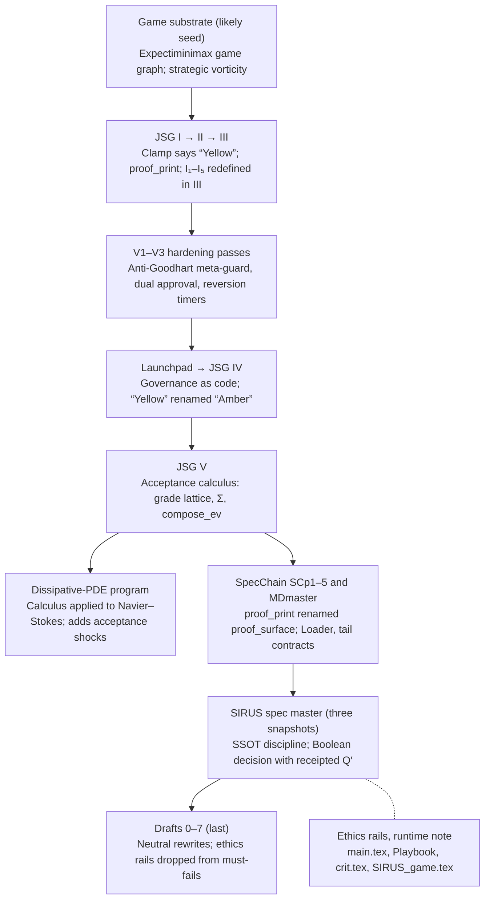

# JSG / SIRUS Master Guide (Skeleton)

Sep 29, 2026 · @Marley McWilliams

## Purpose and reading rules

This guide is the single canon for JSG I–V, SpecChain, the SIRUS spec, the Navier–Stokes program, and the drafts. Every component carries a tag that says what can justify it.

1. **One home per concept.** Each term is defined once, in the glossary. Other documents link to it and never restate it.
2. **Every component names its justification:** provable in Lean now, provable with analysis, checked per certificate, tested in CI, open mathematics, or a declared value (see the layer map).
3. **Conformance is not correctness.** CI shows the work conforms to the spec. Lean shows the spec's internal lemmas hold. Neither shows that a threshold, a model, or a value is right; that stays a signed human decision.
4. **Retired terms stay as aliases.** Old documents keep reading correctly, and new text uses only canonical terms.

## Corpus lineage

The JSG books came first and the neutral drafts last. The order is inferred from renamed terms, because the dates embedded in the files are partly example values.



*corpus lineage · 8 stages, 2 side branches*

Solid arrows mean a stage builds on the one before it; the dashed line marks work from the same period. The PDE program branches off the JSG V calculus.

## Canonical glossary

Twenty-two terms, each with one home. One is still an open decision: the SIRUS name.

| Canonical term | Meaning | Replaces or aliases | Home |
| --- | --- | --- | --- |
| Graded values **G** | Per-axis intervals \[lo, hi\] in \[0, ∞\]; the verdict reads hi; ordered by badness (endpoints) and by information (narrower is better) | "Q" in JSG V, the PDE paper and SCp2 | Core v2 |
| Floor axes **M** | Per-window rates; combined by max | max-channels, Q\_max | Core v2 |
| Budget axes **S** | Cumulative spends; combined by +; each carries a subadditivity side condition | sum-channels, Q\_sum, ledger and CVaR axes | Core v2 |
| Unknown | The interval \[0, ∞\]; a lease β allows width up to β, and anything wider is a breach | ⊤unk (JSG V, PDE); ⊥ in SCp2 (the information order); "third value" (SIRUS spec) | Core v2; PDE I4b |
| Combine **⊕** | Endpointwise max on M, + on S; a commutative monoid, not a join (on S, g ⊕ g = 2g) | "Parallel join"; horizontal ⊕ (JSG V); ∧ (PDE); ⊎ and ⊙ (SCp2) | Core v2 |
| Sequential composition | Resolved: the same ⊕; sequence and parallel differ only in data flow | vertical ⊓ (JSG V); ⋆, and ∧ as its alias (SCp2) | Core v2 |
| Residual **θ ⊸ g** | Budget left for later stages: θ ⊖ g on S; θ on M when g ≤ θ | None | Core v2 |
| Decision **D** | {REJECT < ACCEPT}; no third value | "Q" in the SIRUS spec | SIRUS spec §1.2 |
| Verdict map **δ\_θ** | Indicator of the down-set of θ, read on upper endpoints | Implicit threshold checks | Core v2 |
| Receipted result **R** | (grade, receipt address, metrics). The decision is derived as δ\_θ(grade), never stored, and metrics cannot influence the grade | Q′ | SIRUS spec §1.4 |
| Obligations **Σ** | Typed: each has a witness type and an authority stage; progress is the Dershowitz–Manna order | Typed effects | Core v2 |
| Must-pass set **MP** | Inputs the gate must ACCEPT; disjoint from the must-fail set | None | Core v2 |
| Frontier charge **Δ\_fr** | Total variation A · Σ‖jump\_k‖ at the finest resolution; additive, so regrouping can't change it | C\_fr, frontier spend, C\_salt, the subadditive merged-crossing debit | Core v2 |
| **proof\_surface** | Window or run digest binding the guard IDs in fixed order | proof\_print, proof print | SCp1 |
| Guard order | EF → DRO → PR → CBF → ω | None | JSG III |
| **ω stage** | Automata verdict over KPI row hashes; the fifth guard | "Ω" in the SIRUS pipeline | JSG III |
| Uncertainty set **𝒰** | Model-uncertainty set for PR/GKYP witnesses and degraded profiles | "Ω" in JSG II–IV, including Ω\_wc | JSG IV §Ω contract |
| Clamp states | Green, Amber, Red | "Yellow" | JSG IV |
| Invariant families | Prefix by family: H1–H5 (governor, JSG III list), A1–A5 (PDE acceptance), L1–L10 (Loader), T11–T13 (tail contracts) | I₁–I₅ (three incompatible versions); I1–I13 | New |
| Policy lattice **⪰** | Dials in a complete lattice, larger is stricter; E(t) = baseline ⊓ active weakenings; threshold dials store their inverse | "Strictest unexpired policy P\*"; ThresholdChange VC semantics | Core v2 |
| **SIRUS** (this project) | The governance and evidence spec | Also the name of Bénard et al.'s random-forest rule-set algorithm; the two were merged in MDmaster | Open: rename or disambiguate |
| Content address | BLAKE3-256 of canonical bytes | `b3:…` placeholders (849 in the master spec) | SIRUS spec §0.5 |

## Layer map

Eleven components can be proved in Lean now and five more with analysis; the other eight are checked per instance, tested, open, or declared. Lean status is "Stub" wherever the Lean section below already states the theorem.

| Component | Layer | Lean status | Source |
| --- | --- | --- | --- |
| Graded values: combine laws, interchange equation, residual threading | Lean now | Stub | JSG V §2 |
| Receipt integrity: replaying the addressed content yields the grade | Lean now | Not started | JSG V §2 |
| Verdict: unknown rejects; complete evidence within θ accepts | Lean now | Stub | SIRUS spec §1.2–1.3 |
| Noninterference: metrics cannot change the grade | Lean now | Stub | SIRUS spec §1.4 |
| Loader: invariant preserved; Dershowitz–Manna progress | Lean now | Stub | JSG V §3; PDE Lemma 2.1 |
| Frontier charge: additive under regrouping; chattering never free | Lean now | Stub | MDmaster SCp3 |
| Policy lattice: expiry tightens; bridge to acceptance | Lean now | Stub | PDE Lemma 10.1 |
| Calibration: must-pass accepted, must-fail rejected, sets disjoint | Lean now | Stub | JSG IV policy conservativity |
| Capped governance fold: bounded, with a vacuous nightly check | Lean now | Stub | JSG IV aggregator lemma |
| Must-fail CI gate: accepted histories keep every unsigned failure class | Lean now | Stub | Draft0–7 |
| Typed obligations (authority and witness); unknowns lease as interval width ≤ β | Lean now | Not started | PDE I4b |
| CVaR tail-to-level step (C₀ = 1) | Lean + analysis | Not started | PDE Lemma 9.1 |
| No-Zeno dwell bound, corrected | Lean + analysis | Stub | JSG I Lemma 1 |
| Local KL–Fisher quadratic bound | Lean + analysis | Not started | JSG I FIM bound |
| DRO envelope identity dv/dρ = η\* | Lean + analysis | Not started | JSG II ρ-sensitivity |
| Geometry-scaled Jacobi frontier defect | Lean + analysis | Not started | JSG I Lemma 3 |
| PR/GKYP witnesses | Certificate | Not applicable | JSG II–IV |
| CBF tube residuals and saltation replay | Certificate | Not applicable | JSG III |
| Statistical gates: HAC and bootstrap CIs, BY FDR, SPRT, MTC; interval enclosure (lo ≤ truth ≤ hi) at a declared coverage | CI / test | Not applicable | JSG II |
| Determinism envelope and proof\_surface replay | CI / test | Not applicable | SIRUS spec §12; JSG IV |
| ACT→JSG compiler soundness and completeness | Open math | Not started | JSG IV Launchpad |
| Navier–Stokes regularity spine L1–L5 | Open math | Not applicable | DissipativePDEs |
| Golden Rule, restoration debt, consent brake, bravery-as-accountability | Norm | Not applicable | main.tex |
| Alignment budgets and override taxonomy | Norm | Not applicable | JSG I appendix |

## Unified core objects (v2)

Four objects carry the calculus. This revision folds in an outside review of v1, which found that its seven objects were partly the same object in different notation, and that a gate rejecting everything satisfied every v1 theorem.

**1. Graded values.** Each axis holds an interval \[lo, hi\] in \[0, ∞\], and the verdict reads hi. A known value is \[x, x\], full ignorance is \[0, ∞\], and a lease β allows \[x, x + β\]. Floor axes M carry per-window rates and combine by max; budget axes S carry cumulative spends and combine by +. Both are commutative ordered monoids, so the operation is called **combine**, not join: on budgets, g ⊕ g = 2g.

```latex
[a,b] \oplus [c,d] = \begin{cases} [\max(a,c),\ \max(b,d)] & \text{floor axis} \\ [a+c,\ b+d] & \text{budget axis} \end{cases}
```

Sequential and parallel composition use the same ⊕. A stage is a function X → G × Y; stages in sequence pass Y along and combine their grades, so the two kinds of composition differ only in data flow, and interchange holds as an equation. Each budget axis registers a soundness side condition: the real quantity must be subadditive under composition, as CVaR is.

**2. Residuated budgets.** The verdict is the indicator of the down-set of θ, read on upper endpoints. On budget axes, accepted parts do not combine into an accepted whole, so each stage is checked against the residual that earlier stages left:

```latex
\theta \multimap g = \max\{h : g \oplus h \le \theta\} = \begin{cases} \theta & \text{floor axis, when } g \le \theta \\ \theta \ominus g \ \text{(truncated subtraction)} & \text{budget axis} \end{cases}
```

The same mechanism covers thresholds, the frontier charge, the governance cap and any explicit step bound. The frontier charge is total variation: A · Σ‖jump\_k‖ at the finest resolution. It is additive under concatenation, so no regrouping can change it, and chattering across a frontier and back is never free. A is computed conservatively, with ν̂\_min as a lower confidence bound and κ\_max, r\_tube as upper bounds, in ENNReal so that ν̂\_min = 0 gives A = ∞.

**3. Typed obligations.** Each obligation o has a witness type W(o) and an authority stage. Discharging o requires a witness of type W(o) produced at authority(o), and a window passes only when every emitted obligation was discharged that way. The Loader's progress is measured by the Dershowitz–Manna order on its pending obligations, which allows one obligation to be replaced by finitely many smaller ones. Its safety is a separate theorem: an invariant Inv (L1–L10) preserved by every accepted step. A halt with rejection carries the remaining obligations and the axes still unknown as its certificate.

**4. Policy lattice.** A policy maps dials into a complete lattice where larger is stricter; must-fail sets are dials valued in a powerset. The effective policy is a monotone baseline met with the active weakenings:

```latex
E(t) = B(t) \wedge \bigwedge \{\, w : w \text{ active at } t \,\}
```

Expiry removes a term from the meet, so it can only make E stricter. Thresholds are looser when larger, so a threshold dial stores its inverse, and the bridge theorem catches the mistake if it doesn't: if P₂ ⪰ P₁ then Accept(P₂) ⊆ Accept(P₁). Weakenings are priced by magnitude × duration against a token bucket: a reservoir of capacity C that refills at rate ρ per window, both of them dials. Without the refill this is the lifetime budget again, just draining more slowly. The bucket bounds the rate of weakening, not its persistence: a weakening that costs at most ρ per window can be renewed forever, so three options are open: set ρ to the standing weakening you accept, cap each weakening's cumulative duration, or raise each consecutive renewal's cost by a factor γ > 1, which any finite C and ρ eventually refuse. Escalation must be keyed to the dial being weakened, not to the request, or relabeling and brief lapses would reset it. It also needs a deliberate reset, such as decay after a quiet period, or one long episode leaves the dial effectively frozen.

**Positive controls.** Every property above is a safety property, and a gate that rejects everything satisfies all of them. Two counterweights are required: a must-pass set MP of inputs that must ACCEPT, kept disjoint from the must-fail set, and a completeness lemma: complete evidence whose values are within θ is accepted. That lemma stays nearly definitional unless a statement ties each interval to the true value (lo ≤ truth ≤ hi). That enclosure is empirical, because truth is measured: it holds at a declared coverage level and belongs to the CI layer, or to the certificate layer when the interval comes from exact computation on a model. It is not a Lean item. The real guard against vacuity is the must-pass set together with the always-reject mutant.

## Lean 4 statement stubs (v2)

This is an uncompiled sketch against Mathlib. Every theorem carries a `Mutant:` comment naming a plausible wrong implementation that fails it; a theorem without one doesn't earn its place. Confirm every Mathlib name with Loogle before relying on it, including `Multiset.IsDershowitzMannaLT`.

```lean
import Mathlib

namespace JSG

/-! ## 1. Graded values -/

/-- Floors carry per-window rates (combine by max);
    budgets carry cumulative spends (combine by +). -/
inductive Kind | floor | budget

/-- An axis value is an interval in [0, ∞]; the verdict reads `hi`. -/
@[ext] structure Bound where
  lo : ENNReal
  hi : ENNReal
  le : lo ≤ hi

def Bound.known (x : ENNReal) : Bound := ⟨x, x, le_rfl⟩
def Bound.unknown : Bound := ⟨0, ⊤, le_top⟩

def combineAxis : Kind → Bound → Bound → Bound
  | .floor,  a, b => ⟨max a.lo b.lo, max a.hi b.hi, max_le_max a.le b.le⟩
  | .budget, a, b => ⟨a.lo + b.lo, a.hi + b.hi, add_le_add a.le b.le⟩

variable {ι : Type} (kind : ι → Kind)

abbrev Grade (ι : Type) := ι → Bound

def combine (g h : Grade ι) : Grade ι := fun i => combineAxis (kind i) (g i) (h i)

theorem combine_comm (g h : Grade ι) : combine kind g h = combine kind h g := by sorry

theorem combine_assoc (g h k : Grade ι) :
    combine kind (combine kind g h) k = combine kind g (combine kind h k) := by sorry
-- Mutant: averaging budgets, (a + b) / 2, is commutative but not associative.

/-- Sequential and parallel composition agree: interchange is an equation. -/
theorem interchange (a b c d : Grade ι) :
    combine kind (combine kind a b) (combine kind c d)
      = combine kind (combine kind a c) (combine kind b d) := by sorry
-- Mutant: JSG V's rule (max on every axis in sequence, + on budgets in parallel).

/-! ## 2. Verdicts and residuals -/

inductive Decision | reject | accept
  deriving DecidableEq

/-- Accept iff every upper bound is within its threshold. -/
noncomputable def verdict (θ : ι → ENNReal) (g : Grade ι) : Decision := by
  classical
  exact if ∀ i, (g i).hi ≤ θ i then .accept else .reject

/-- Fail-closed: an unknown axis rejects whenever its threshold is finite. -/
theorem verdict_unknown (θ : ι → ENNReal) (g : Grade ι) (i : ι)
    (hθ : θ i < ⊤) (hu : g i = Bound.unknown) : verdict θ g = .reject := by sorry
-- Mutant: a verdict that reads `lo` instead of `hi` accepts unknowns.

/-- Completeness: complete evidence within θ is accepted. -/
theorem verdict_complete (θ : ι → ENNReal) (g : Grade ι)
    (hk : ∀ i, (g i).lo = (g i).hi) (hin : ∀ i, (g i).lo ≤ θ i) :
    verdict θ g = .accept := by sorry
-- Mutant: the always-REJECT gate, which satisfies every safety theorem here.

/-- Budget left for later stages; ENNReal subtraction truncates at 0. -/
def residual (θ x : ENNReal) : ENNReal := θ - x

/-- Checking stage two against stage one's residual is checking the total. -/
theorem residual_spec (θ x y : ENNReal) (hθ : θ ≠ ⊤) (hx : x ≤ θ) :
    y ≤ residual θ x ↔ x + y ≤ θ := by sorry
-- Mutant: checking each stage against the full θ accepts x = y = θ.

/-- Raw evidence plus free-form metrics such as confidence scores. -/
structure Evidence (E : Type) where
  record  : E
  metrics : List (String × Float)

/-- No confidence inflation, stated where it can fail: an obligation on every grader. -/
def Noninterfering {E : Type} (gradeOf : Evidence E → Grade ι) : Prop :=
  ∀ r m m', gradeOf ⟨r, m⟩ = gradeOf ⟨r, m'⟩
-- Mutant: a grader that narrows `hi` when a confidence metric is high.

/-- No confidence inflation: with a noninterfering grader, metrics cannot flip the verdict. -/
theorem no_flip {E : Type} (θ : ι → ENNReal) (gradeOf : Evidence E → Grade ι)
    (hni : Noninterfering gradeOf) (r : E) (m m' : List (String × Float)) :
    verdict θ (gradeOf ⟨r, m⟩) = verdict θ (gradeOf ⟨r, m'⟩) := by
  rw [hni r m m']
-- Mutant: the same grader; Mutants.lean exhibits metrics that flip its verdict.

/-! ## 3. Loader: safety and progress, kept separate -/

structure Loader (S O : Type) [Preorder O] where
  step     : S → S → Prop
  Inv      : S → Prop                                  -- L1–L10
  inv_step : ∀ s t, Inv s → step s t → Inv t
  pending  : S → Multiset O
  progress : ∀ s t, step s t → Multiset.IsDershowitzMannaLT (pending t) (pending s)

/-- Safety: every reachable state satisfies the invariant. -/
theorem Loader.safe {S O : Type} [Preorder O] (L : Loader S O) {s t : S}
    (hs : L.Inv s) (hr : Relation.ReflTransGen L.step s t) : L.Inv t := by sorry
-- Mutant: a step that skips one L-check still terminates but breaks this.

/-- Progress: no infinite run. -/
theorem Loader.terminates {S O : Type} [Preorder O] [WellFoundedLT O]
    (L : Loader S O) : WellFounded (fun t s => L.step s t) := by sorry
-- Mutant: a retry that re-emits the same obligation cannot satisfy `progress`.

/-! ## 4. Frontier charge -/

variable {E : Type} [NormedAddCommGroup E]

/-- Total variation: charge every jump at the finest resolution. -/
noncomputable def charge (A : ENNReal) (jumps : List E) : ENNReal :=
  A * (jumps.map (fun v => (‖v‖₊ : ENNReal))).sum

/-- Additive under concatenation, so regrouping can't change it. -/
theorem charge_append (A : ENNReal) (j₁ j₂ : List E) :
    charge A (j₁ ++ j₂) = charge A j₁ + charge A j₂ := by sorry

/-- Chattering is never free. -/
theorem charge_chatter (A : ENNReal) (v : E) :
    charge A [v, -v] = 2 * A * (‖v‖₊ : ENNReal) := by sorry
-- Mutant: v1's merged-jump charge, under which (v, -v) costs 0.

/-! ## 5. Policy lattice -/

variable {P : Type} [CompleteLattice P]   -- larger = stricter

/-- Baseline met with the weakenings active now. -/
def effective (B : P) (active : Set P) : P := B ⊓ sInf active

/-- Expiry can only make the policy stricter. -/
theorem expiry_tightens (B : P) {a a' : Set P} (h : a' ⊆ a) :
    effective B a ≤ effective B a' := by sorry
-- Mutant: "revert to the most recent policy", which can land on a weaker one.

/-- The bridge: tighter thresholds never admit more inputs. -/
theorem bridge {Inp : Type} (gradeOf : Inp → Grade ι) {θ₁ θ₂ : ι → ENNReal}
    (h : θ₂ ≤ θ₁) :
    {x | verdict θ₂ (gradeOf x) = .accept} ⊆ {x | verdict θ₁ (gradeOf x) = .accept} := by sorry
-- Mutant: a threshold dial stored un-inverted, so "stricter" raises θ.

/-- JSG IV's fold, kept to document its defect: the nightly check cannot fail. -/
def fold (Rmax lam : ℝ) (rs : List ℝ) : ℝ :=
  rs.foldl (fun x y => min Rmax (x + lam * y)) 0

theorem fold_check_vacuous (Rmax lam : ℝ) (h : 0 ≤ Rmax) (rs : List ℝ) :
    fold Rmax lam rs ≤ Rmax := by sorry

/-! ## 6. Calibration -/

/-- Accept every must-pass input, reject every must-fail input, sets disjoint. -/
def Calibrated {Inp : Type} (gate : Inp → Decision) (MP MF : Set Inp) : Prop :=
  Disjoint MP MF ∧ (∀ x ∈ MP, gate x = .accept) ∧ (∀ x ∈ MF, gate x = .reject)
-- Mutant: the always-REJECT gate fails this as soon as MP is nonempty.

/-- The CI gate on must-fail sets: a new version keeps every failure class,
    unless a signed weakening covers what it removes. -/
def mfGate {C : Type} (signed : Set C → Prop) (old new : Set C) : Prop :=
  old ⊆ new ∨ signed (old \ new)

/-- Every history the gate accepts, with no signed removals, only grows. -/
theorem mfGate_monotone {C : Type} (signed : Set C → Prop) (MF : ℕ → Set C)
    (hg : ∀ t, mfGate signed (MF t) (MF (t + 1)))
    (hs : ∀ s, signed s → s = ∅) : Monotone MF := by sorry
-- Mutant: Draft0–7's history, which dropped GOLDEN_RULE_BREACH with nothing signed.

/-! ## 7. No-Zeno kernel (analysis layer, corrected form) -/

/-- If the signed distance moves no faster than `Smax`,
    going from `+r` to `-r` takes at least `2r / Smax`. -/
theorem dwell_lower_bound {d : ℝ → ℝ} {Smax r t₁ t₂ : ℝ} (hS : 0 < Smax)
    (hlip : ∀ s t, |d t - d s| ≤ Smax * |t - s|)
    (h₁ : d t₁ = r) (h₂ : d t₂ = -r) (ht : t₁ ≤ t₂) :
    2 * r / Smax ≤ t₂ - t₁ := by sorry
-- Mutant: JSG I's version, which assumes |ḋ| ≥ α at the frontier instead of a speed
-- bound; a trajectory with |ḋ| = 100α crosses far faster than the claimed τ_min.

end JSG
```

Four pieces are deferred to Milestone 2 or later: typed obligations with witness types and authorities (pass-soundness), receipt integrity (replaying the content at a receipt's address yields its grade), the token-bucket trace invariant for weakenings, and a `Noninterfering` proof for each concrete grader. v1's `monotone_compose` and `discharge_wf` are dropped, since each held for any implementation. `no_flip` and `mustFail_monotone` are restated where they can fail: on the grader, and on the CI gate.

## Known defects and proposed fixes

Seventeen defects so far. The last seven came from an outside review of v1 and are fixed in core v2.

| Defect | Where | Why it matters | Proposed fix |
| --- | --- | --- | --- |
| Nightly fold check cannot fail | JSG IV aggregator lemma, R10, GovernanceFold | Once the total saturates at R\_max, later weakenings add nothing, so small loosenings accumulate unseen | Price weakenings by magnitude × duration against a token bucket (core v2) |
| No-Zeno proof sketch inverts its inequality | JSG I Lemma 1, ported to II–IV and the PDE paper | ḋ ≥ α − L·d bounds transit time from above, not below; the stated τ\_min treats α as a speed ceiling | Add the speed bound S\_max (C2); state τ\_min ≥ 2r/S\_max; keep α only to exclude sliding |
| Exchange-certificate bound is a hash | PDE paper §4.2, ExchCert | The bound replays exactly but carries no analytic content | Derive the bound from its norm and side conditions; keep the hash only to bind it |
| Three incompatible definitions of Q, with clashing operator symbols | JSG V, PDE paper, SCp2, SIRUS spec | Proofs about one "Q" don't transfer to another | Adopt core v2's graded values, decision and receipted result |
| Name collision on SIRUS | MDmaster, "SIRUS API Reference" and "SIRUS Unified Documentation" | Documentation for Bénard et al.'s rule-set algorithm was merged in, with "\[Unverified\]" stubs | Remove those sections; rename the project or add a disambiguation line |
| Placeholder content addresses | SIRUS spec: 849 `b3:…` against 11 real digests | SSOT pointers don't bind anything yet | Generate digests in CI; fail the build on any `b3:…` |
| Drafts drop must-fails that their own rule protects | main.tex rails vs Draft0–7 | The corpus breaks its own monotone-governance rule | Restore the rails as must-fails, or record the removal as a signed, expiring weakening |
| Invariant numbering overloaded | JSG II vs III, PDE paper, SCp3–4 | "I₃" means different things in different files | Prefix by family, as in the glossary |
| Navier–Stokes L4 is conditional | PDE paper Lemma 3.5 | It assumes a finite ledger sum, which is where the difficulty lies | Keep the spine in the open-math layer; let nothing else depend on it |
| "If the CI passes, the work is correct" | Human\_Guide, step 4 | CI shows conformance, not correctness; cross-checking two agents misses errors they share | Reword: "If CI passes, the work conforms to the spec" |
| Subadditive frontier debit lets regrouping net out chattering | PDE Lemma 10.1; v1 core object 4 | Jumps v and −v cost 2A‖v‖ charged separately and 0 merged | Charge total variation at the finest resolution |
| `safety_or_halt` proves only termination | v1 Lean stubs; SCp3 | Well-foundedness is a variant, not an invariant, and a step counter satisfies any lexicographic rank | Prove invariant preservation separately; take progress from pending obligations |
| ⊤ means both "unknown" and "infinitely bad" | JSG V; PDE I4b; SCp2 | The unknowns lease has no representation, since one unknown makes a whole budget axis ⊤ | Interval-valued axes |
| P\* can be undefined | JSG IV | Incomparable unexpired policies have no strictest member | E(t) = baseline ⊓ active weakenings |
| The v1 admission rule is a lifetime budget | v1 fix for the fold | It never releases, so eventually nothing is admissible; counting only active weakenings would allow endless renewal | Magnitude × duration against a token bucket |
| A safety-only core | v1 core and stubs | A gate that rejects everything satisfies every v1 theorem | Must-pass set and a completeness lemma |
| `no_flip` tests a type, not a property | v1 stubs | It closes by `rfl` because the projection ignores metrics, while inflation happens upstream in grading | Noninterference on the grading function |

## Source map

Seven sources stay canonical, four merge into the guide, two split, and the rest are archived. Rows follow the lineage order.

| Source | Canonical for | Action | Note |
| --- | --- | --- | --- |
| JSG I | Hybrid calculus, No-Zeno, alignment primitives | Keep | Fix the No-Zeno lemma first |
| JSG II | Runtime guards, MTC and IV badges, decision range, lever dictionary | Merge | Into the operations chapter |
| JSG III | Guard order, failure cookbook, lever ABI, curvature-per-collateral | Merge | Canonical for guard order |
| V1–V3 | Anti-Goodhart meta-guard, dual approval, out-of-band monitors, VCs | Merge | Merge the deltas, then archive the files |
| JSG IV Launchpad | Framing claim and the adequacy theorem statement | Keep | Becomes the guide's introduction |
| JSG IV | ACT compiler R1–R9, governance as code, emergency VCs | Keep | Canonical governance; fix the fold |
| JSG V | Acceptance calculus: G, Σ, compose\_ev | Keep | Canonical algebra |
| DissipativePDEs | Frontier subadditivity, CVaR bridge, acceptance shocks, Navier–Stokes spine | Split | Calculus parts into JSG V; Navier–Stokes into a research notebook |
| MDmaster | SpecChain SCp1–5 (Loader, tail contracts), game substrate, forward/inverse duality | Split | Keep SpecChain and the game sections; remove the SIRUS-algorithm sections |
| SIRUS\_SPEC\_MASTER | SSOT discipline, decision layer D and R, GMM, SSG, self-specification | Keep | The one canonical snapshot |
| SIRUS\_SPEC\_MASTER\_revised, Untitled.md | Near-duplicate snapshots, each about 1,300–1,450 lines different | Archive | Diff once for anything the master lacks |
| main.tex, Operational\_Playbook, crit.tex | Normative rails, the vow, the human-facing guide | Keep | Norm layer and onboarding |
| Repo\_conventions, Human\_Guide | WorkCard schema, PR plan, agent orchestration loop | Merge | Contributor docs; reword the CI claim |
| SIRUS.tex | Table scaffolding for the fixed pipeline | Archive | Template only |
| SIRUS\_game.tex | A pdfLaTeX error log; the runtime note survives only in its missing-character lines | Archive | Recover the text first |
| Draft7 | Neutral external proposal | Keep | The external-facing summary |
| Draft0–6 | Earlier versions of the same proposal | Archive | Superseded by Draft7 |

## Roadmap

Two decisions remain, then freeze the glossary and prove in three milestones. Milestone 1 already holds a real catch: the fold check.

- [x] Decide sequential composition: resolved in core v2 (the same ⊕; rates are floors, spends are budgets)
- [ ] Decide whether the normative rails are must-fails inside the gates or a declared layer outside them
- [ ] Decide how persistent weakenings are handled: refill rate ρ as the accepted standing level, a cap on each weakening's cumulative duration, or renewal cost escalating by a factor γ, keyed to the dial
- [ ] Freeze the glossary and run one rename pass: 𝒰 for Ω, proof\_surface, Amber, invariant prefixes, combine for join
- [ ] Lean milestone 1: graded values, verdict and completeness, residuals, calibration, fold vacuity
- [ ] Lean milestone 2: typed obligations, Loader safety and progress, frontier charge, policy lattice
- [ ] Lean milestone 3 (analysis): CVaR tail-to-level, the corrected dwell bound, then the local KL–Fisher bound
- [ ] CI: fail the build on any `b3:…` placeholder, on any must-fail removed without a signed weakening, and on any theorem without a mutant
- [ ] Recover the SIRUS\_game runtime note and remove the SIRUS-algorithm sections from MDmaster
- [ ] Move the Navier–Stokes spine to a research notebook, outside the guide's dependency graph

The step-by-step plan for doing all of this is in Project roadmap.
