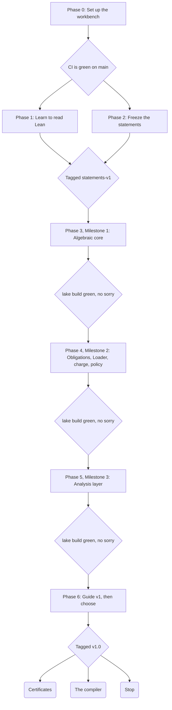

# Project roadmap

Seven phases, each ending at a gate you can check yourself. You move on when a gate passes, not when a date arrives, and the last phase includes permission to stop.

## At a glance



*project roadmap · 7 phases, 6 gates, 3 closing options*

Each diamond is a gate: the checklist at the end of that phase's section. Phase 1 feeds the same gate as Phase 2, because reviewing statements takes both.

## Ground rules

You own the statements, Claude Code owns the proofs, and the kernel gives the verdict. Five stop rules keep the scope from creeping.

**You own the statements.** Lean checks that a proof is valid. It cannot check that a statement means what you intended, and the [Lean reference](https://lean-lang.org/doc/reference/latest/ValidatingProofs/) draws exactly that line. The [Thomson N=7 repo](https://github.com/huwngtran/thomson-n7-lean) is candid about it: its description says the statement is not human-certified. Reviewing statements is the one job nobody can do for you.

**Claude Code owns the proofs.** It writes, repairs and refactors proof code. It never edits the statements file.

**The kernel gives the verdict.** Nothing counts as proved until CI passes: the build is green, there is no `sorry`, and the axioms are only `propext`, `Classical.choice` and `Quot.sound`.

**Every theorem needs teeth.** A theorem earns its place only if a plausible wrong implementation would fail it. Each theorem names such a mutant, and `JSG/Tests/Mutants.lean` proves that the mutant violates the statement. If even a gate that rejects everything would pass a theorem, the theorem says nothing about this gate. A mutant shows that a statement can fail, not that it catches the mistakes you will actually make, so take mutants from real defects in the corpus where you can: the v1 fold, the subadditive debit, the inverted No-Zeno inequality, the drafts' dropped must-fails.

The stop rules:

1. **Gates, not dates.** Advance when a phase's gate passes. With no deadlines, there is nothing to fall behind on.
2. **Parking lot.** New ideas go into `guide/IDEAS.md`, never into the current milestone.
3. **Three strikes.** If a theorem resists three sessions, mark it Open in the layer map with one line on why, and move on.
4. **The archive is read-only.** The original papers are never rewritten; new text goes into the guide.
5. **Main always builds.** A red build on `main` gets fixed before any new work. This is what stops errors from compounding.

## Phase 0: Set up the workbench

The goal is a repo whose CI builds one trivial theorem, with every original file committed untouched.

**You:** install Lean and VS Code from the [official quickstart](https://docs.lean-lang.org/lean4/doc/quickstart.html), then confirm that the Mathlib cache downloads (`lake exe cache get`). Create the GitHub repo.

**Claude Code:** scaffold the layout below. Add CI with [lean-action](https://github.com/leanprover/lean-action), switching on `leanchecker: true`. Put this doc, exported to markdown, into `guide/`.

```
jsg-sirus/
├── archive/                 # original .tex/.md/.pdf files, never edited
├── guide/                   # MASTER_GUIDE.md, ROADMAP.md, IDEAS.md, CHANGELOG.md
├── lean/
│   ├── lakefile.toml
│   ├── lean-toolchain
│   ├── JSG/Statements.lean  # the fixed challenge: definitions, theorems as sorry
│   ├── JSG/Proofs/          # one file per milestone
│   └── JSG/Tests/           # sanity examples and negative controls
├── scripts/check.sh         # build, axiom audit, statements-unchanged check
├── CLAUDE.md
└── .github/workflows/ci.yml
```

The layout borrows from the Thomson repo, which keeps its fixed challenge file and its solution as separate Lake libraries and checks the challenge's hash in a script.

**Line endings, before the first commit.** On Windows, Git converts line endings by default. That would quietly change the "untouched" archive files, and it would make `Statements.lean` hash differently on your PC than in CI, which runs on Linux. Commit this `.gitattributes` first:

```
* text=auto eol=lf
archive/** -text
```

Two companions keep it airtight. Set your editor to save with LF (in VS Code, `"files.eol": "\n"`), so files don't change before Git sees them. And have the statements check compare what Git stores rather than the bytes on disk, for example `git diff --exit-code statements-v1 -- lean/JSG/Statements.lean` once the tag exists. If anything was committed before this file, run `git add --renormalize .` once.

**Gate**

- [x] `.gitattributes` is in the first commit, before any other file
- [x] CI is green on `main` with one trivial theorem
- [x] `archive/` holds every original file, committed once
- [x] `CLAUDE.md` is in place (starter below)

## Phase 1: Learn to read Lean

The goal is to read a theorem statement and a short proof and explain each line. You are training to review statements, not to become a Lean expert. This phase runs alongside Phase 2.

1. Start with the Natural Number Game, listed on the community's [learning resources](https://leanprover-community.github.io/learn.html) page, for tactic basics.
2. Work through [Mathematics in Lean](https://leanprover-community.github.io/mathematics_in_lean/) chapters 2–4 (basics, logic, sets and functions) and chapter 7 (structures). That covers Milestone 1. Chapters 11–13 (topology, calculus, measure theory) wait until Milestone 3.
3. Get comfortable with the two Mathlib types the revised core is built on: `ENNReal`, the extended non-negative reals, whose subtraction truncates at zero; and complete lattices, with `⊓` and `sInf`.
4. Use [Loogle](https://loogle.lean-lang.org/) to search Mathlib by name or type shape. Most of Milestone 1 is finding the right existing lemma.
5. Have Claude explain proofs line by line, but write the two easiest ones yourself: `combine_comm` and `expiry_tightens`.

**Gate**

- [ ] You proved `combine_comm` without Claude writing it
- [ ] You can explain every line of the Milestone 1 block of `Statements.lean` in plain English

## Phase 2: Freeze the statements

The goal is `Statements.lean` v1: the fixed target every later proof is judged against, like the Thomson challenge file.

**You:**

1. Adopt core v2 and the v2 Lean stubs from the master guide, then settle the remaining open decision: whether the normative rails are must-fails.
2. Review each definition and theorem. Fix anything that doesn't say what you mean, and give every theorem a plain-English docstring.
3. Write the controls in `JSG/Tests/`: must-pass inputs the gate must ACCEPT, must-fail inputs it must REJECT, and, for each theorem, one mutant where it fails and one witness instance where it holds. The compiler checks only that names exist, so these are what catch a statement with a real name used the wrong way round, such as swapped arguments to a relation. For instance, the always-REJECT gate is the mutant for `verdict_complete`.

**Claude Code:** make the stubs compile with `sorry`, prove each mutant's counterexample and each witness instance in `JSG/Tests/Mutants.lean`, and add the statements check (a diff against the tag, per Phase 0) to `scripts/check.sh`.

**Gate**

- [ ] `Statements.lean` compiles, with `sorry` as its only gap
- [ ] Every theorem has a docstring you wrote or approved
- [ ] Every theorem's mutant counterexample and witness instance are proved, before any milestone proof starts; a counterexample that comes too easily is a warning that the statement may be false for everything
- [ ] The file is tagged `statements-v1`, and any later change needs a `CHANGELOG.md` line saying whether it tightens or weakens

## Phases 3–5: The three proof milestones

Each milestone proves one block of `Statements.lean` and closes at the same gate. Milestone 1 already holds a real catch: proving `fold_check_vacuous` shows the governance check can never fail.

| Milestone | Theorems | Read first | Expected difficulty |
| --- | --- | --- | --- |
| 1: Algebraic core | `combine_comm`, `combine_assoc`, `interchange`, `verdict_unknown`, `verdict_complete`, `residual_spec`, `fold_check_vacuous` | Mathematics in Lean ch. 2–4, 7; the `ENNReal` API | Low: case splits on axis kind, plus finding the right `ENNReal` lemmas |
| 2: Obligations, Loader, charge, policy | Typed obligations, `Loader.safe`, `Loader.terminates`, `charge_append`, `charge_chatter`, `expiry_tightens`, `bridge` | Mathematics in Lean ch. 5–6 | Low to medium: Dershowitz–Manna and lattice lemmas take some finding |
| 3: Analysis layer | CVaR tail-to-level, `dwell_lower_bound`, local KL–Fisher bound, DRO envelope identity | Mathematics in Lean ch. 11–13 | Medium to high: the statements need as much care as the proofs |

Of Milestone 3's statements, only `dwell_lower_bound` is in `statements-v1`. Write and freeze the rest (a `statements-v2` tag) before any proof work on them starts.

**Gate for every milestone**

- [ ] `lake build` is green, with no `sorry` in the milestone's proof file
- [ ] `#print axioms` on each theorem lists only `propext`, `Classical.choice` and `Quot.sound`
- [ ] The statements check confirms `Statements.lean` is unchanged
- [ ] Each theorem's named mutant is proved to violate it, and every must-pass control is accepted
- [ ] Layer-map rows are set to Proved, and the guide's text names the Lean theorem
- [ ] A short note, in your words: what is now proved, and what it does not show

## Phase 6: Guide v1, then choose

The goal is a tagged release that a stranger could clone and check. After it, you pick at most one next direction, or none.

**Gate**

- [ ] `README.md` and `REPRODUCE.md` explain how to build and check everything
- [ ] Every layer-map row has a status and points to its Lean theorem or its reason for being out of scope
- [ ] One run of the gold-standard check: Comparator with the nanoda kernel against `Statements.lean`, as the [Lean reference](https://lean-lang.org/doc/reference/latest/ValidatingProofs/) describes
- [ ] Tagged `v1.0`

**Then pick one:**

- **Certificates.** Check PR/GKYP witnesses as exact rationals in Lean. The Thomson proof does this for semidefinite certificates: a numerical solver finds them, they are rounded to exact numbers, and Lean checks those numbers.
- **The compiler.** State the Launchpad's adequacy theorem precisely, then freeze it as `statements-v3`.
- **Stop.** A tagged v1 with a proved core is a finished project.

## One sitting with Claude Code

One sitting, one target. The same six steps every time keep sessions small enough to review.

1. **Pick one target** from the current phase: one theorem, or one setup task. Write it as the first line of your prompt.
2. **Brief Claude Code:** the target, the files it may touch, and "stop and report when the build is green, or after three approaches fail."
3. **Read the diff when it stops.** If `Statements.lean` appears in it, reject the change.
4. **Check the verdict:** run `scripts/check.sh` yourself, or read the CI result on the pull request.
5. **Ask for a five-line explanation** of the proof in plain English, and paste it into the milestone note.
6. **Close out:** update the layer map, merge, and move any new idea into `IDEAS.md`.

## CLAUDE.md starter

Paste this into the repo root in Phase 0. It turns the ground rules into standing instructions that Claude Code reads at the start of every session.

```markdown
# Working rules for this repo

## Roles
- The human owns `lean/JSG/Statements.lean`. Never edit it.
  If a statement looks wrong or unprovable, stop and explain why.
- Proofs go in `lean/JSG/Proofs/`, helper lemmas in `lean/JSG/Lemmas/`.
- `archive/` is read-only.

## Definition of done
- `lake build` passes with no errors, and no warnings in files you touched.
- No `sorry`, `admit`, `axiom`, or native evaluation (`native_decide`, `decide +native`).
- `#print axioms` on each target shows only propext, Classical.choice, Quot.sound.
- Every theorem has a named mutant, and `JSG/Tests/Mutants.lean` proves the mutant violates it.
  Prefer mutants taken from real defects in archive/ over invented ones.
- Every theorem also has a witness instance in `JSG/Tests/` where it holds.
- `scripts/check.sh` passes.

## How to work
- One target per session unless told otherwise.
- Search Mathlib (Loogle, exact?, apply?) before writing a helper lemma.
- Treat any Mathlib name recalled from memory, yours or another model's, as a guess until Loogle confirms it.
- Never weaken a hypothesis or change a statement to make a proof go through.
- After three failed approaches, stop. Report what you tried, what blocked you,
  and whether the statement itself might be false.
- End every session with: files changed, theorems closed, ideas added to guide/IDEAS.md.
```

The ban on native evaluation matters because the independent checkers in the gold-standard check cannot replay native computation.

## Sources

Pages checked Sep 29, 2026. When you get stuck, the [Lean Zulip](https://leanprover.zulipchat.com/) is where the community answers questions.

- [Thomson N=7 Lean proof package](https://github.com/huwngtran/thomson-n7-lean): a worked model of a statements-first repo, with a fixed challenge file, a check script and a claims index
- [Validating a Lean Proof](https://lean-lang.org/doc/reference/latest/ValidatingProofs/): the escalating checks, from axioms to leanchecker to Comparator
- [lean-action](https://github.com/leanprover/lean-action): the GitHub Action for CI, with `leanchecker` and `nanoda` switches
- [Comparator](https://github.com/leanprover/comparator): judges a proof against a fixed statement file
- [Mathematics in Lean](https://leanprover-community.github.io/mathematics_in_lean/): the textbook for Phase 1 and the milestones
- [Options to use Lean](https://leanprover-community.github.io/get_started.html): install, learning resources, Loogle and Zulip links
